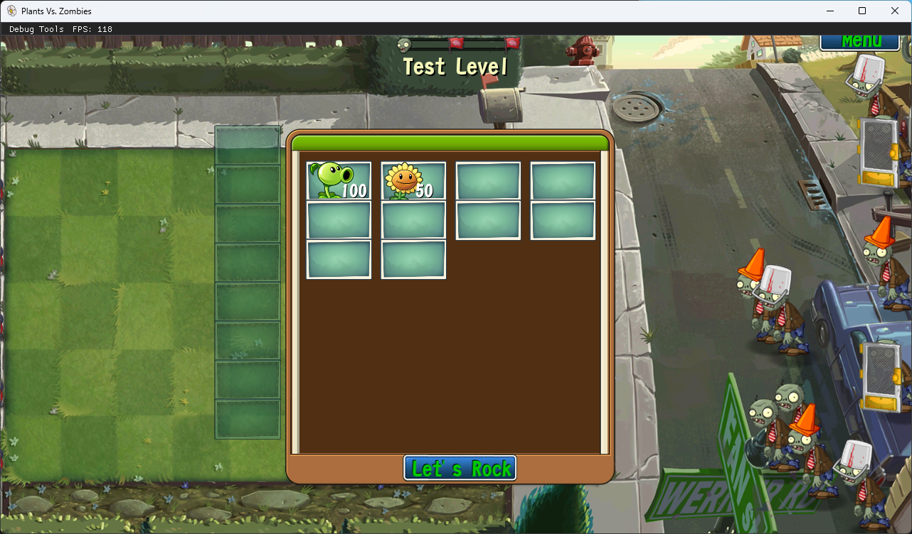

# SFML_Lawn

### 这是一个用C++写的植物大战僵尸同人框架，致力于OpenGL，C++项目的学习和植物大战僵尸同人游戏的开发，支持植物大战僵尸一带的Reanim动画，支持多文件打包，支持纹理图集，使用自主开发的游戏框架SimpleGameFramework，支持3D模型渲染（底层OpenGL） 

# 运行示例

具体视频在[视频链接](https://www.bilibili.com/video/BV1vBPBeKE3J/)

## 所有源代码文件遵循MIT协议开源
## 使用的第三方库
- ### [SDL](https://www.libsdl.org/)
- ### [SDL-mixer](https://github.com/libsdl-org/SDL_mixer)
- ### [SDL-image](https://github.com/libsdl-org/SDL_image)
- ### [Nlohmann](https://github.com/nlohmann/json)
- ### [Imgui](https://github.com/ocornut/imgui)
- #### imgui-opengl3,imgui-sdl2
- ### [pugixml](https://github.com/zeux/pugixml)
- ### [glew](https://glew.sourceforge.net/)
- ### [glm](https://github.com/g-truc/glm)
### 均遵循MIT协议

# How to build
使用vcpkg安装项目依赖项，x86平台，编译，运行，在生成exe的同级目录下放入资源文件，即可正常运行
